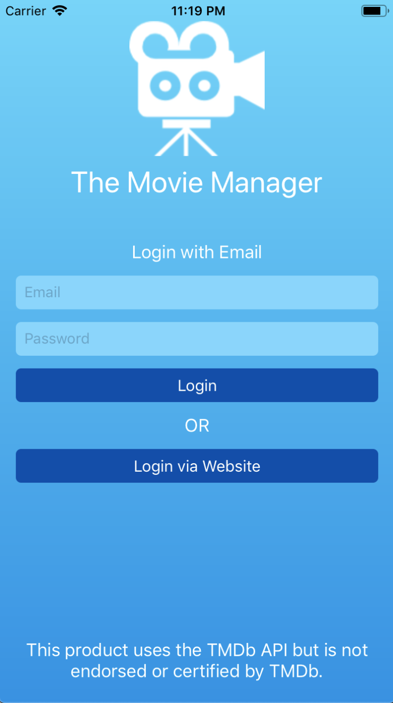
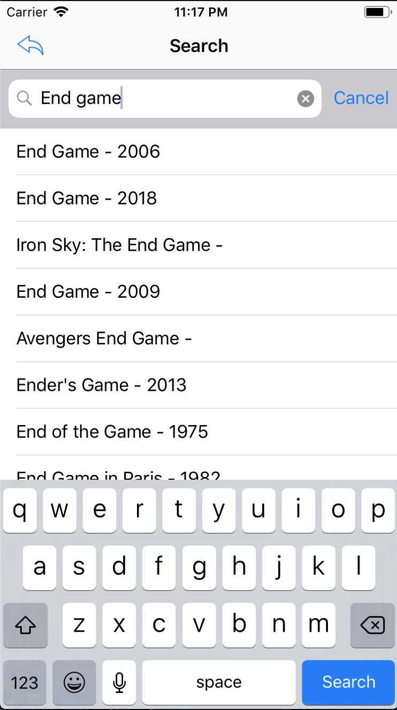
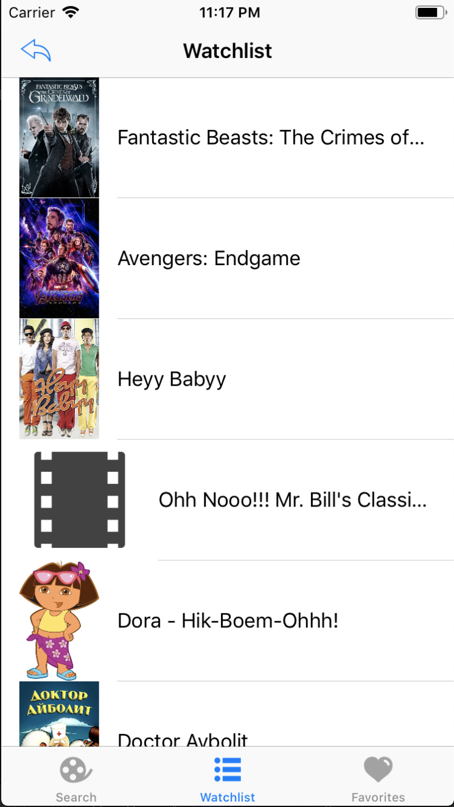
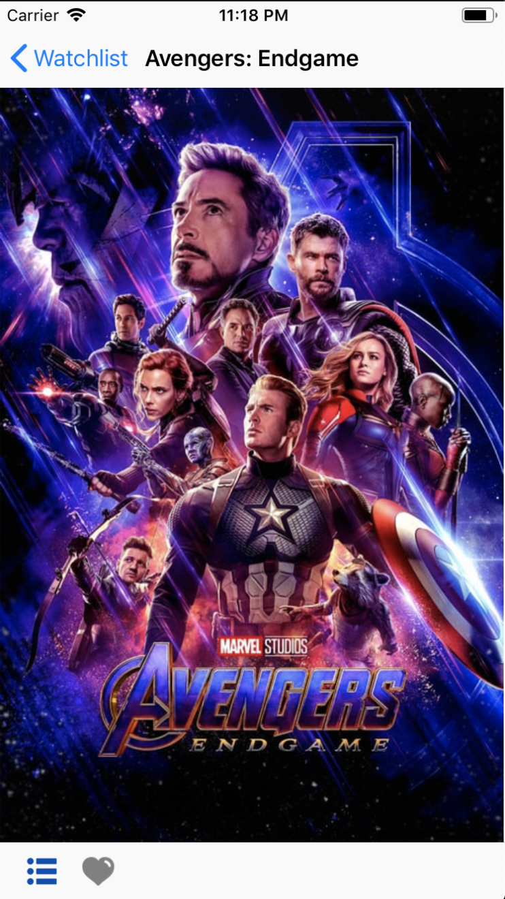

# The Movie Manager App
## 

### What Used?
- Swift 5 and Xcode
- HTTP Requests with URLSession and URLRequest
- The Movie Database (TMDb) API Endpoints

### What it does?

### Demo
Welcome Page                 |2                               | 3
:---------------------------:|:------------------------------:|:------------------------------:
             |             | 

4                            |  5                             | 6
:---------------------------:|:------------------------------:|:------------------------------:
            |           | 
